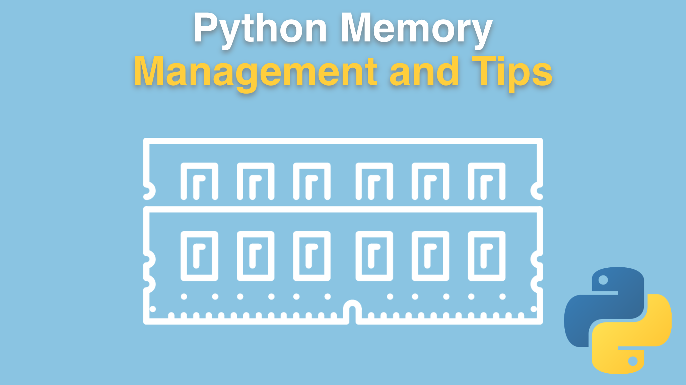

# [Python Memory Management and Tips Course](https://talkpython.fm/memory)

This very unique course will teach **not just how Python memory management works** 
and how to create code that functions well within that world, it will provide
many **concrete techniques, tools, design patterns, and more to make your programs
more memory efficient** and computationally faster to boot.

If Python memory (allocations, clean up, and so on) has always felt like a weird
black box that you have had to take for granted, **join this course and open that box**.
There are many beautiful and interesting aspects of Python's runtime behavior making
your code run. You should understand what's happening on your behalf.

## What topics are covered

In this course, you will:

* Learn how Python variables and data structures actually look in the CPython layer
* See how **the small object allocator** treats most objects differently than your intuition
* Understand Python's memory allocation primitives: **blocks**, **pools**, and **arenas**
* Locate the **elements on C code** responsible for Python memory behavior
* See **reference counting in action** with live code explorations
* Discover why **reference counting alone is not enough** for memory cleanup
* **Work with Python's GC** and see when it's needed, and when it's not 
* **Compare different data structures** to get a sense of their relative size
* Use multiple clever but simple techniques to **massively reduce memory during function calls**
* **Lighten up your classes** with properties
* Leverage multiple memory profilers to **investigate memory usage** line by line and over time
* And lots more

## Who is this course for?

This course is for **anyone who wants to understand how Python memory is managed 
and make their code more efficient and faster**. If you're tired of Python memory being a black box
hiding its behavior, turn on the light with this course.

The student requirements are quite light for this course. You'll need Basic Python language knowledge:

* Classes
* Functions
* Properties
* Variables
* Loops
* Iteration

**Note**: All software used during this course, including editors, Python language, etc.,
are 100% free and open source. You won't have to buy anything to take the course.

## Take the course

[Take the course online today at Talk Python Training](https://talkpython.fm/memory).